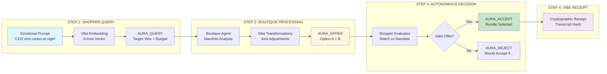
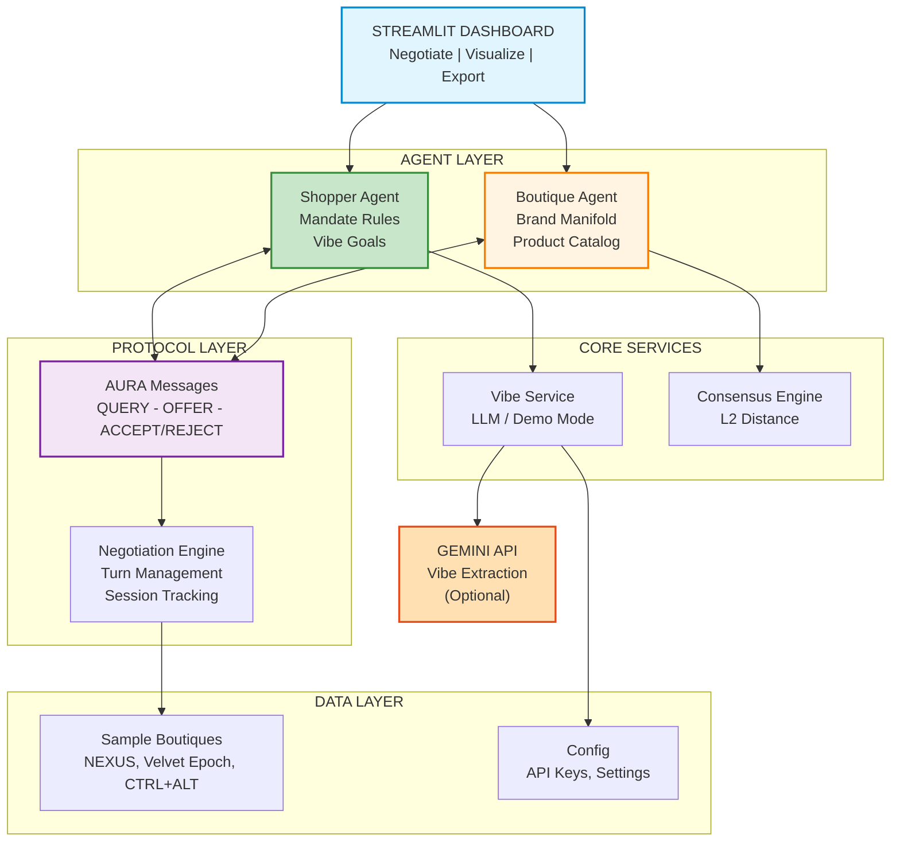
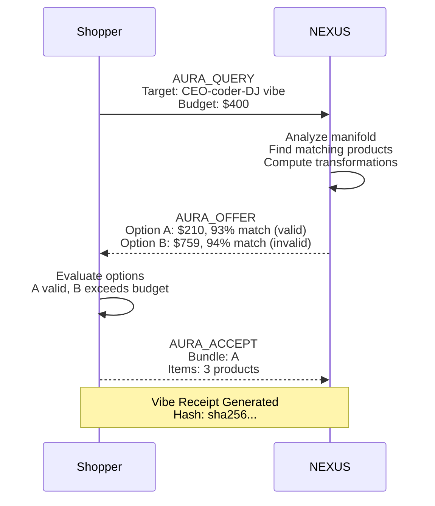

# Protocol: Aura - AI-Powered Aesthetic Commerce

[](https://www.python.org/downloads/)
[](https://streamlit.io/)
[](https://opensource.org/licenses/MIT)
[]()

**The first protocol that allows AI Agents to negotiate *Meaning* instead of just *Metadata*.**

## Quick Highlights

- **Agent-to-Agent Negotiation**: Shopper and Boutique agents negotiate in 8-dimensional vibe-space
- **L2 Distance Matching**: Mathematical formula ensures objective aesthetic alignment
- **Dual-Option Offers**: Budget-fit vs Vibe-fit bundles with clear trade-offs
- **Autonomous Decisions**: Agents accept/reject based on mandate rules, not human clicks
- **Vibe Receipt**: Cryptographic proof of negotiation with transcript hash
- **Fast Setup**: Install and run in under 2 minutes

## Architecture Overview

### High-Level Workflow



### System Architecture



### Tech Stack

| Layer | Technology | Purpose |
|-------|-----------|---------|
| **Frontend** | Streamlit 1.37+ | Interactive dashboard with radar charts |
| **Backend** | Python 3.11 | Async agents and negotiation engine |
| **AI Engine** | Gemini 2.0 Flash | Vibe vector extraction (optional) |
| **Visualization** | Plotly | 8-axis radar charts |
| **Validation** | Pydantic 2.0+ | Protocol message schemas |
| **Package Manager** | uv | Fast dependency management |

## The Problem

Current Agentic Commerce (like Google's "Buy for Me") is **transactional, not aesthetic**:

- Matches by specs (size, color, price)
- No understanding of vibes or aesthetics
- Human must click "Buy" - not truly autonomous
- No negotiation between AI agents
- No proof of what was agreed upon

## The Solution

AURA creates a protocol where:

- **Vibes are quantified** in 8-dimensional latent space
- **Agents negotiate** match vs constraints
- **Autonomous decisions** based on mandate rules
- **Trade-offs are explicit** (Budget-fit vs Vibe-fit)
- **Cryptographic receipts** prove what was negotiated

## The Mathematical Core

### Aesthetic Match Formula

The similarity score **S** between a Shopper's Vibe **Vs** and a Product's Vibe **Vp** uses L2 Euclidean distance:

```
S(Vs, Vp) = 1 / (1 + sqrt(sum((Vs_i - Vp_i)^2)))
```

### Match Thresholds

| Match Score | Classification | Agent Action |
|------------|----------------|--------------|
| **> 0.90** | High-fidelity match | Autonomous Accept |
| **0.70 - 0.90** | Aesthetic Neighbor | Negotiate transformations |
| **< 0.70** | Vibe Mismatch | Skip or Reject |

### Vibe Axes (8-Dimensional Space)

| Axis | Low (0.0) | High (1.0) |
|------|-----------|------------|
| `rebellion` | Conformist | Rebellious |
| `minimalism` | Maximalist | Minimalist |
| `nostalgia` | Futuristic | Vintage |
| `power` | Soft/Gentle | Powerful/Bold |
| `warmth` | Cold/Distant | Warm/Inviting |
| `chaos` | Structured | Chaotic |
| `elegance` | Rough/Raw | Elegant |
| `playfulness` | Serious | Playful |

## Features

### Core Protocol
- **AURA_QUERY** - Shopper sends target vibe + constraints
- **AURA_OFFER** - Boutique proposes dual bundles (A: Budget-fit, B: Vibe-fit)
- **AURA_ACCEPT** - Shopper accepts best valid offer
- **AURA_REJECT** - Shopper rejects with "would accept if" clause

### Negotiation Engine
- **Turn Management** - 2-turn negotiation with status tracking
- **Constraint Checks** - Budget, vibe distance, item count
- **Latency Tracking** - Real-time response times
- **Session Storage** - Full transcript history

### Vibe Transformations
- **Axis Adjustments** - "playfulness: 71% to 43% (-28%)"
- **Item-Level Changes** - "remove color accents; go monochrome serious"
- **Trade-off Explanations** - Why vibe drift is necessary

### Dashboard
- **Radar Charts** - Visual 8-axis vibe comparison
- **Dual Option Cards** - Side-by-side Budget vs Vibe bundles
- **Valid/Invalid Indicators** - Clear constraint status
- **Vibe Receipt Export** - JSON with transcript hash

## Quick Start

### Prerequisites

- Python 3.11+
- (Optional) Gemini API Key for live LLM mode

### Installation

```bash
# Clone and navigate
git clone https://github.com/your-repo/protocol-aura.git
cd protocol-aura

# Install with uv (recommended)
uv sync

# Run the demo
uv run streamlit run src/protocol_aura/ui/dashboard.py
```

Or with pip:

```bash
pip install streamlit plotly pydantic pydantic-settings
streamlit run src/protocol_aura/ui/dashboard.py
```

### Usage

1. **Enter Aesthetic Goal** - "CEO who codes at night and DJs on weekends"
2. **Set Budget** - Use slider ($50 - $1000)
3. **Click Negotiate** - Agents negotiate across 3 boutiques
4. **Review Results** - See match scores, options, transformations
5. **Export Receipt** - Download cryptographic Vibe Receipt

## Demo Boutiques

| Store | Aesthetic | Signature Axes |
|-------|-----------|----------------|
| **NEXUS** | Cyber-noir minimalism | power up, minimalism up, warmth down |
| **Velvet Epoch** | Vintage romantic | nostalgia up, elegance up, rebellion down |
| **CTRL+ALT+STYLE** | Chaotic maximalism | chaos up, playfulness up, minimalism down |

## Example Negotiation



## Project Structure

```
protocol-aura/
├── src/protocol_aura/
│   ├── agents/
│   │   ├── base.py              # Abstract agent class
│   │   ├── shopper.py           # Shopper agent (mandate evaluation)
│   │   └── boutique.py          # Boutique agent (offer generation)
│   ├── protocol/
│   │   ├── models.py            # VibeVector, Product, Manifold
│   │   ├── messages.py          # AURA_QUERY, OFFER, ACCEPT, REJECT
│   │   └── embeddings.py        # Vibe service (LLM / demo)
│   ├── core/
│   │   ├── config.py            # Settings and environment
│   │   └── negotiation.py       # Negotiation engine
│   ├── data/
│   │   └── sample_boutiques.py  # Demo store data
│   ├── ui/
│   │   └── dashboard.py         # Streamlit app
│   └── api/
│       └── main.py              # FastAPI endpoints
├── .env                          # API keys and settings
├── pyproject.toml               # Dependencies
└── README.md                    # This file
```

## Configuration

```bash
# .env file
AURA_GEMINI_API_KEY=your_key_here    # Optional: for live LLM
AURA_DEMO_MODE=true                   # true = keyword vibe, false = LLM
AURA_LLM_MODEL=gemini-2.0-flash      # Gemini model
```

## Hackathon Innovation

### Why AURA Stands Out

1. **Novel Problem Space**
   - First protocol for aesthetic negotiation between AI agents
   - Fills gap in agentic commerce (specs vs vibes)

2. **Mathematical Foundation**
   - L2 distance in 8-dimensional latent space
   - Quantifiable match scores with clear thresholds

3. **Protocol Design**
   - Structured message types (QUERY, OFFER, ACCEPT, REJECT)
   - Extensible for future COUNTER turns

4. **Autonomous Decisions**
   - Agents follow mandate rules without human clicks
   - Clear "would accept if" clauses for transparency

5. **Cryptographic Proof**
   - Vibe Receipt with transcript hash
   - Verifiable negotiation history

### The Gap We Fill

| Feature | Traditional Commerce | AURA |
|---------|---------------------|------|
| Search | Keywords | Vibe vectors |
| Matching | Specs (size, color) | Aesthetic distance |
| Negotiation | None | A2A protocol |
| Autonomy | User clicks "Buy" | Agent accepts if mandate satisfied |
| Proof | Order confirmation | Vibe Receipt with transcript hash |

## Future Enhancements

- Multi-Round Negotiation - COUNTER messages with revised offers
- Vibe-Receipt Dream Sequence - Suno/Midjourney synthesis
- Real Product Integration - Connect to actual e-commerce
- Cross-Store Protocol - Agents negotiate across multiple boutiques
- Mandate Learning - AI learns user preferences over time

## License

MIT License - see LICENSE file

---

**Built for Hackathon 2024**

*"AURA turns aesthetics into a negotiable contract between agents."*
